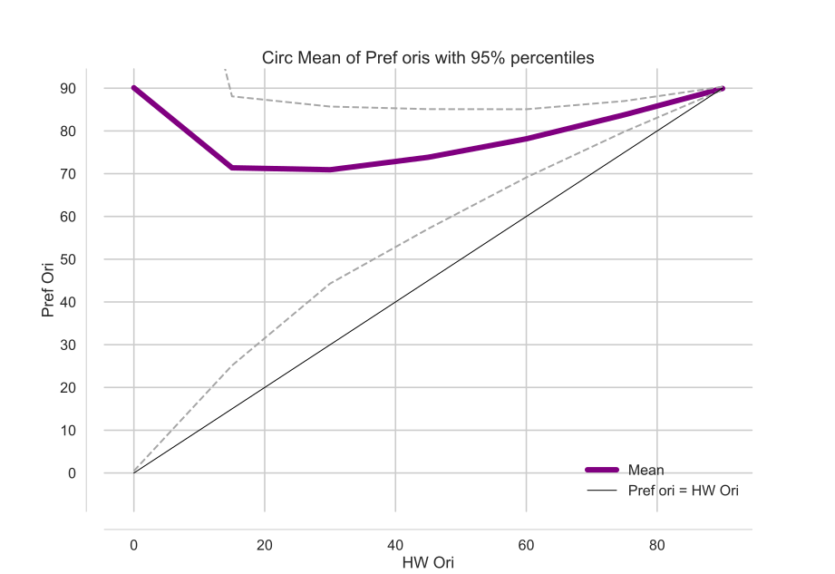

# I has a Science!

## What I Did!

This will be my methods.  

This is the next paragraph


_this is italicised_
__This will be bold__


Now time for my actual methods:

* The first thing I did was ignore my supervisor
* The didn't mind, they left me alone ... it was good.
	* Actually, it wasn't thaaat good.

1. Actually, this was the first thing I did ...
1. I got a coffee!
	1. It wasn't a good coffe
	1. So I got another one
1. Then I went home


[Google](http://www.google.com)

## My Fabulous Figure



> This is what my supervisor said "..."


```matlab
def my_function(data, mode):

	return science.publish(data)

PhD = my_function(data, 'significant')
``` 


